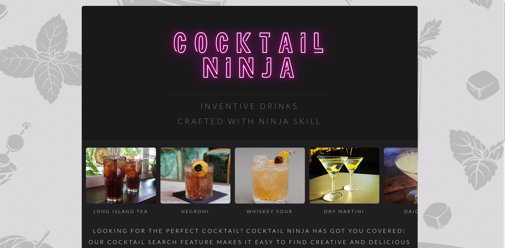
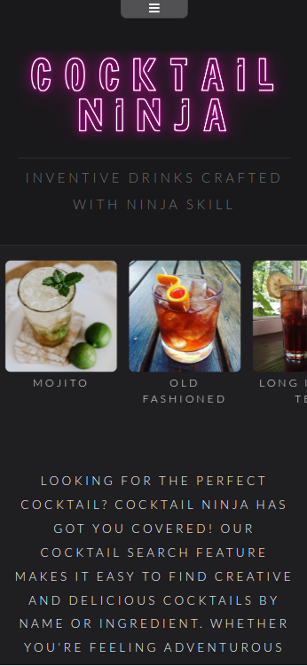
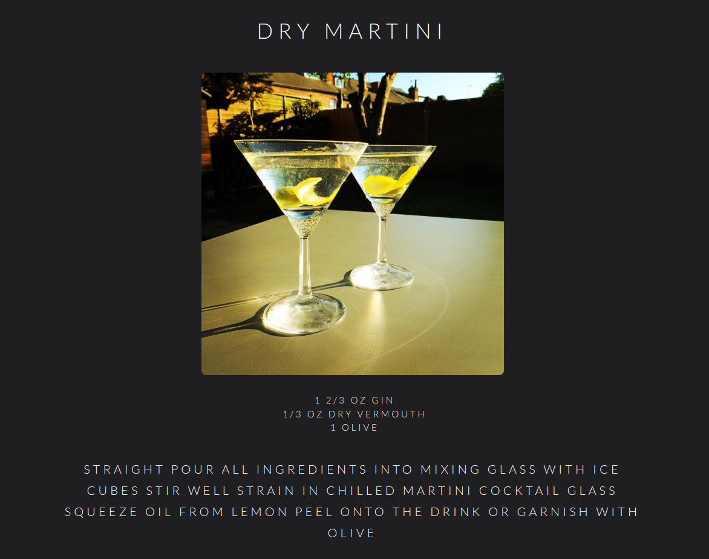

This is a web app that allows users to search for and browse cocktail recipes.

## Features
- Users can search for cocktail recipes using keywords
- Users can browse recipes by categories, such as "Popular", "Trending", and "New"
- Users can view the details of each recipe, including ingredients, instructions, and a photo

## API
This web app uses the TheCocktailDB API to retrieve cocktail recipes. 

## Technologies Used

This web app was built using the following technologies:

- HTML
- CSS
- JavaScript
- SASS
- TheCocktailDB API

### Screenshots

